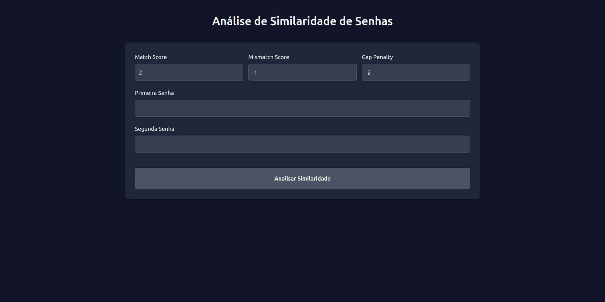

# Password Dissemblance (PD)

**Número da Lista**: 19<br>
**Conteúdo da Disciplina**: PD<br>

## Alunos
| Matrícula | Aluno                       |
|-----------|-----------------------------|
| 202046087 | Fabrício Macedo de Queiroz  |
| 202046004 | Caio Moreira Sulz Gonsalves |

<br>

## Sobre 

O **Password Dissemblance** é uma aplicação web desenvolvida para visualização didática do algoritmo "Alinhamento de Sequência, com o objetivo principal de analisar a similaridade entre duas _strings_, informando o nível de similaridade e mostrando a matriz de _memoization_.

### Funcionalidades

- O usuário pode inserir duas _strings_ para serem comparadas e, ao clicar no botão "Comparar", a aplicação exibe o nível de similaridade entre as _strings_ e a matriz de _memoization_ gerada pelo algoritmo de alinhamento de sequência.

- O usuário também pode alterar os valores utilizados pelo algoritmo, como o custo de um _match_, o custo de um _mismatch_ e o custo de um _gap_.

- **Visualização de Detalhes**: Após clicar em "Analisar Similaridade", é possível verificar a similaridade entre as duas _strings_, e a matriz de _memoization_.

<br>

## Screenshots

<center>

<div>
    <p>Formulário
        
    </p>
    <p>Resultado
        
    </p>
</div>

</center>

<br>

## Linguagens/Frameworks

- **JavaScript Vanilla**: Utilizado para a lógica de interação com o usuário.
- **HTML/CSS**: Utilizado para a estruturação e estilização da página.

<br>

## Uso

### Acesso à Aplicação

Você pode acessar a aplicação pelo seguinte link: [Password Dissemblance](https://password-dissemblance.pages.dev/)

### Instruções de Uso

1. **Inserção de _Strings_**: Insira duas _strings_ senhas que deseja comparar nos campos de texto.
2. **Configuração de Valores**: Altere os valores de _match_, _mismatch_ e _gap_ conforme desejar.
3. **Comparação de _Strings_**: Clique no botão "Analisar Similaridade" para analisar a similaridade entre as _strings_.

<br>

## Manual de como Rodar Localmente

1. **Clone o Repositório**: Clone o repositório do projeto que contém o Password Dissemblance.

   ```bash
   git clone
    ```

2. **Navegue até a Pasta do Projeto**: Entre na pasta do projeto que contém o projeto.

    ```bash
    cd PasswordDissemblance/src/
    ```

3. **Abra o Arquivo HTML**: Abra o arquivo `index.html` em seu navegador.

    ```bash
    open index.html
    ```

<br>

## Vídeos Explicando o Projeto

<a href="https://youtu.be/kOfSdcB5aVo">
</a>

[Vídeo de Apresentação](https://youtu.be/kOfSdcB5aVo)

<br>
